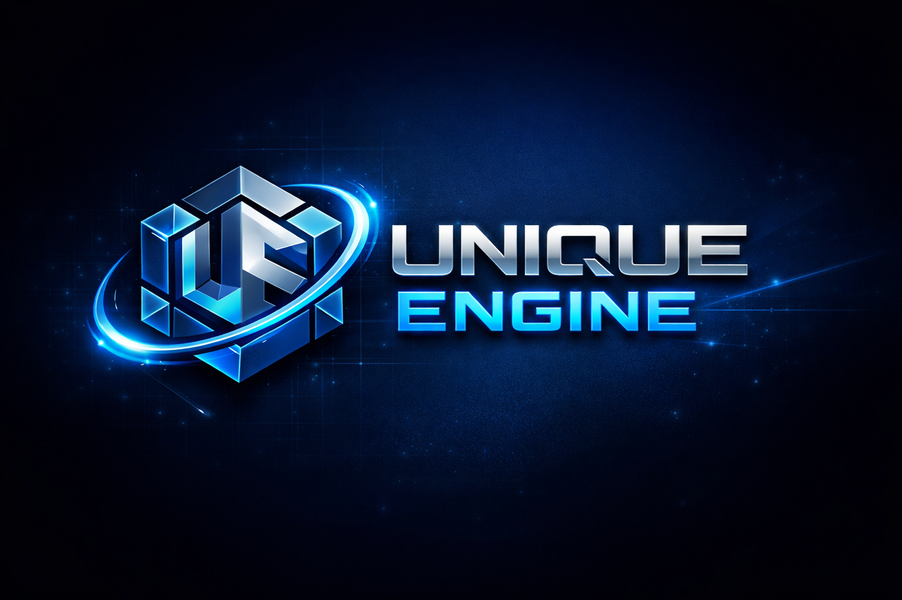

# Unique Engine

<p align="center">
  
</p>

**Unique Engine** is a high-performance, modular 3D game engine and scene framework for **GameMaker**, designed to bring modern real-time rendering, clean architecture, and professional workflows into the GameMaker ecosystem.

Inspired by engines like **Three.js** and modern AAA rendering pipelines, Unique Engine focuses on **performance, extensibility, and clarity**, enabling developers to build complex 3D games while retaining full control over the rendering stack.

---

## ✨ Key Highlights

- **Modern 3D Rendering Pipeline**  
  Optimized forward rendering architecture with correct handling of opaque and transparent materials, depth sorting, and multi-pass rendering.

- **Engine-Grade Architecture**  
  Strict separation between geometry, meshes, materials, cameras, and scene logic, enabling scalable and maintainable projects.

- **GameMaker-Native Integration**  
  Seamlessly integrates with GameMaker’s rendering and view systems without sacrificing flexibility or control.

---

## 🚀 Core Features

### 🎥 Advanced Camera System
A fully featured camera pipeline managing projection and view matrices, tightly integrated with GameMaker’s view system for zero-friction setup and runtime control.

### 🖥 High-Performance Renderer
A robust renderer responsible for:
- Efficient mesh submission
- Automatic light data injection
- Correct depth sorting for transparent and opaque geometry
- Independent render queues

Designed to scale with complex scenes and large object counts.

### 🧩 Optimized Mesh & Transform Logic
World transforms are recalculated **once per frame**, dramatically reducing overhead.  
Supports both dynamic and static meshes with manual update control for maximum performance.

### 💡 Dynamic Lighting System
Full support for multiple real-time light types:
- Ambient
- Point
- Spot
- Directional

Built for physically-based workflows and complex lighting scenarios.

### 🎨 Materials & Textures
Automated shader uniform and sampler management with built-in support for:
- Physically Based Rendering (PBR)
- Automatic light binding
- Custom shader extensibility

### 🧱 Fluent Vertex Format API
Define custom vertex layouts using a clean, chainable builder pattern:

```js
new VertexFormat().position().normal().uv().color().build();
```

### 🧠 Decoupled Geometry & Mesh System

Geometry data is fully separated from mesh instances.
Vertex buffers are automatically generated based on vertex format, vertices, and indices.

### 📐 Comprehensive Math Library

A high-performance math suite featuring:

Vec2, Vec3, Mat3, Mat4, Quaternions, Planes & Rays and much more, with over 400 optimized math functions across specialized modules.

### 🕹 Camera Controls

Production-ready camera addons:

- `OrbitControls` for editor-style navigation

- `PointerLockControls` for FPS / TPS gameplay

### 📦 Professional Model Importing

Native integration with Assimp for importing industry-standard 3D formats:
FBX, GLTF, OBJ, 3DS, and more.

### 💾 Scene Serialization

Import and export complete scenes or individual objects for:

- Save systems

- Scene streaming

- Tooling pipelines

### 🎯 Spatial Queries & Raycasting

Built-in support for:

- Bounding Boxes

- Bounding Spheres

- Precision Raycasting

Ideal for collisions, picking, and gameplay queries.

### 🎞 Animation & Skinning

Supports:

- Hierarchical node animations

- GPU-friendly vertex skinning for rigged characters

### 🧪 Post-Processing & Multi-Pass Rendering

Extensible architecture for advanced visual effects and post-processing stacks.

## 🗺 Roadmap & Planning

Development planning and feature tracking are managed on Trello:
👉 https://trello.com/b/NYfgFbd8/unique-engine

## 🤝 Contributing

Unique Engine is **open source** and welcomes contributions from developers interested in pushing high-quality 3D into the GameMaker ecosystem.

- Report bugs

- Propose features

- Submit pull requests

👉 Issues & contributions:
https://github.com/manuel-di-iorio/unique-engine/issues

## 📄 License

Licensed under the **MIT License**.

Third-party software:

- **GMAssimp.dll** by Giacomo “Jak” Marton (MIT)

Other bundled software, such as Assimp or the included 3d models, are copyrighted by their respective creators and may come with additional usage restrictions. The included extension "GMAssimp.dll", which the engine uses internally to import external models, has been created by Giacomo "Jak" Marton and it is MIT-licensed.

Links to the free 3D models used in the examples:
- https://free3d.com/3d-model/airplane-v2--659376.html
- https://free3d.com/3d-model/cat-v1--522281.html
- https://sketchfab.com/3d-models/pbr-mech-practice-be1e6f50f2c34a5199fd73291389ca20
- https://kenney.nl/assets (for the project scene)
- https://github.com/KhronosGroup/glTF-Sample-Models/tree/main/2.0 (Animated models)

Music included in the Platform demo scene (Pixabay.com):
- Background Music by its_tigri
- Jump sound by Crunchpix Studio
- Collect sound by LIECIO
- Falling sound by Universfield
- Win sound by floraphonic

## 🔗 Useful Links

- 📘 Documentation: https://manuel-di-iorio.github.io/unique-engine/
- 🎮 GameMaker: https://gamemaker.io
- GameMaker Italia: https://gamemakeritalia.it
