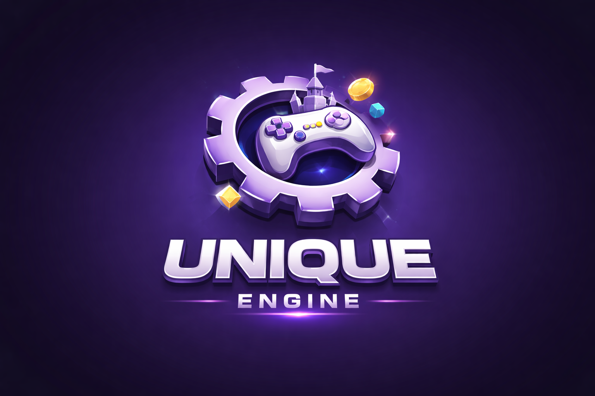

# Unique Engine

Unique Engine is a modular and flexible opensource 3D game engine and scene editor, inspired by Three.js, designed to make it easy to create 3D games in GameMaker. The goal is to offer a simple, accessible and powerful full featured engine, while maintaining a clear and easily extensible structure.

Core Features

- Advanced Camera System Handles 3D projection and view matrices seamlessly, with automatic integration into GameMaker's view system for a hassle-free setup.

- High-Performance Renderer A robust rendering engine that manages mesh drawing, light data transmission, and independent sort-ordering for opaque and transparent materials to ensure correct depth blending.

- Optimized Mesh Logic Efficient rendering with smart matrix updates, ensuring world transforms are recalculated once per frame to maximize performance, with support for static meshes (with manual updates).

- Dynamic Lighting Full support for multiple light types, including Ambient, Point, Spot, and Directional lights, allowing for complex and realistic scene illumination.

- Materials & Textures Automated management of uniforms and samplers. Includes built-in support for Physically Based Rendering (PBR) and automatic light data injection into shaders.

- Fluent Vertex Format API Create custom vertex formats using a clean, chainable builder pattern: new VertexFormat().position().normal().uv().color().build()

- Decoupled Geometry & Mesh Separates geometric data from the visual mesh, automatically generating vertex buffers based on the specified format, vertices, and indices.

- Comprehensive Math Library A modular and high-performance math suite featuring Vec2, Vec3, Mat3, Mat4, Quaternions, Planes, and Rays, with over 400 functions across dozens of specialized modules.

- Flexible Camera Controls Includes ready-to-use addons like OrbitControls for smooth orbiting, panning, and zooming, and PointerLockControls for FPS/TPS style navigation.

- Professional Model Importing Integration with the AssimpDLL (by Jak) for importing a wide variety of external 3D formats (FBX, GLTF, OBJ, etc.) directly into the engine.

- Scene Serialization Support for importing and exporting entire scenes or individual objects to external buffers for easy saving and loading.

- Spatial Queries & Raycasting Built-in support for Bounding Boxes, Bounding Spheres, and precision Raycasting against meshes and lines for collisions and object selection.

- Post-Processing & Multi-Pass Shaders Extensible architecture for multi-pass rendering, enabling advanced visual effects and complex post-processing stacks.

- Animation & Skinning Supports both node-based hierarchical animations and advanced vertex skinning for rigged characters and complex mechanical movements.

## Trello board:

https://trello.com/b/NYfgFbd8/unique-engine

---

### Contribute

The project is open source and open to contributions!
Report bugs, feature requests or open a pull request on [GitHub](https://github.com/manuel-di-iorio/unique-engine/issues).

### License

[MIT License](LICENSE.md)

Other bundled software, such as Assimp or the included 3d models, are copyrighted by their respective creators and may come with additional usage restrictions. The included extension "GMAssimp.dll", which the engine uses internally to import external models, has been created by Giacomo "Jak" Marton and it is MIT-licensed.

Links to the free 3D models used in the examples:
- https://free3d.com/3d-model/airplane-v2--659376.html
- https://free3d.com/3d-model/cat-v1--522281.html
- https://sketchfab.com/3d-models/pbr-mech-practice-be1e6f50f2c34a5199fd73291389ca20
- https://kenney.nl/assets/holiday-kit (for the snow scene)
- https://github.com/KhronosGroup/glTF-Sample-Models/tree/main/2.0 (Animated models)

Music included in the Platform demo scene (Pixabay.com):
- Background Music by its_tigri
- Jump sound by Crunchpix Studio
- Collect sound by LIECIO
- Falling sound by Universfield
- Win sound by floraphonic

### Useful Links

- [Documentation](https://manuel-di-iorio.github.io/unique-engine/)
- [Game Maker Official Website](https://gamemaker.io)
- [Game Maker Italia Community](https://gamemakeritalia.it)
